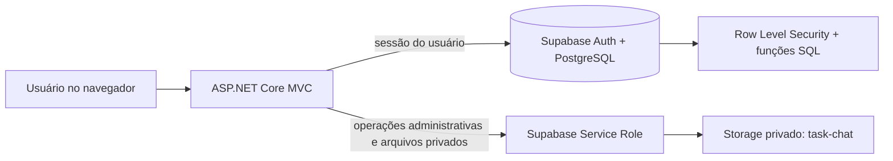
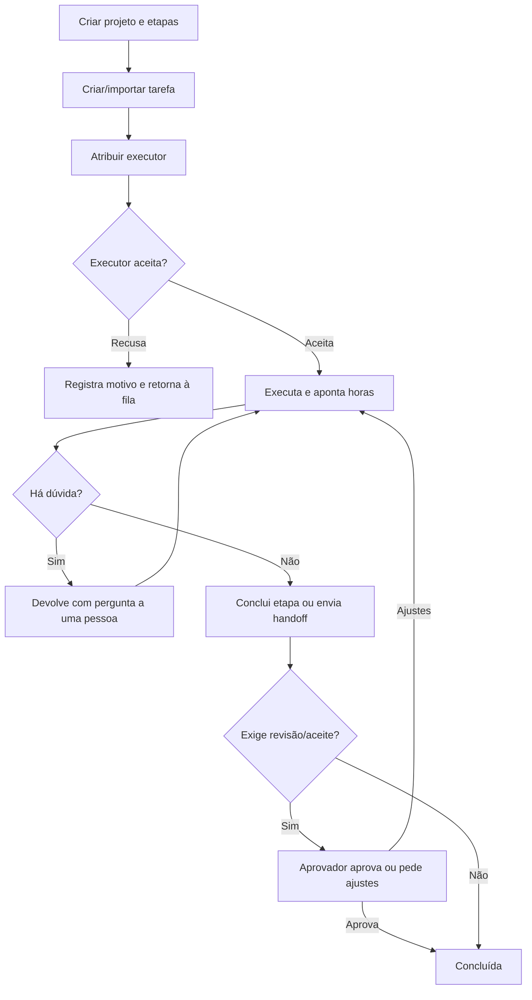

# Manual do Sistema — PulseBoard

> Manual técnico-operacional do PulseBoard, baseado na implementação atual em ASP.NET Core MVC (.NET 8) e Supabase.

## 1. Visão geral

O PulseBoard é um sistema de gestão de projetos e trabalho. Ele organiza projetos em quadros, tarefas em etapas configuráveis, pessoas, capacidade, prazos, aprovações e faturamento. O desenho central é: **o aplicativo apresenta e orquestra o trabalho; o Supabase aplica a identidade, as permissões de dados e as regras transacionais críticas**.



### Tecnologias

| Camada | Tecnologia / responsabilidade |
|---|---|
| Interface | Razor Views, Tailwind via CDN, Lucide e Frappe Gantt |
| Aplicação | ASP.NET Core MVC em .NET 8 |
| Autenticação | Supabase Auth, convertido em cookie seguro de 8 horas no servidor |
| Dados | PostgreSQL do Supabase, acessado pelo `supabase-csharp` / PostgREST |
| Regras críticas | Funções, gatilhos, índices e políticas RLS no banco |
| Arquivos | Bucket privado `task-chat` no Supabase Storage |
| Exportação | ClosedXML para planilhas Excel |
| Hospedagem prevista | Docker e Render, com health check em `/health` |

## 2. Perfis e permissões

Há três papéis gravados em `profiles.role`.

| Perfil | Acesso principal |
|---|---|
| `user` | Seus projetos e tarefas autorizados por RLS; Meu trabalho, quadros compartilhados, comentários, apontamentos, notificações e perfil. |
| `manager` | Tudo que um usuário faz, além de planejamento, equipe, cronograma, relatórios, faturamento e organização. |
| `admin` | Mesmos módulos gerenciais, com administração de usuários, equipes, clientes e dados organizacionais. |

As páginas de gestão usam as políticas `ManagerOrAdmin`; faturamento usa `FinanceAccess` (hoje concede a `admin` e `manager`). A autorização de telas é uma proteção adicional: as políticas RLS do Supabase continuam limitando as linhas devolvidas ao usuário autenticado.

## 3. Mapa da navegação

| Área | Rota | Quem usa | Finalidade |
|---|---|---|---|
| Início / Meu trabalho | `/Work` | Todos | Caixa operacional pessoal: atenção, próximas tarefas, itens aguardando terceiros e concluídas. |
| Projetos | `/Boards` | Todos autorizados | Lista e cria projetos; abre os quadros. |
| Detalhe do projeto | `/Boards/Details/{id}` | Participantes | Kanban, tabela ou Gantt; detalhes de cada tarefa. |
| Operações do projeto | `/BoardOperations/Index?id={id}` | Gestor do projeto | Colunas, WIP, aprovações, substituições, espelhos, dependências e ações em massa. |
| Importação | `/BoardOperations/Import?id={id}` | Gestor do projeto | Prévia e importação de `.xlsx` ou `.csv`. |
| Cronograma | `/Schedule` | Gestão | Visão corporativa de projetos, tarefas, marcos e vínculos. |
| Central de gestão | `/Planning` | Gestão | Riscos, capacidade, prazos, baseline, modelos e recorrências. |
| Equipe | `/Management` | Gestão | Capacidade semanal e visão da equipe. |
| Faturamento | `/Billing` | Gestão | Contratos, aprovação de horas e faturas. |
| Indicadores | `/Reports` | Gestão | Indicadores filtráveis e exportação Excel. |
| Painel executivo | `/Executive` | Gestão | Carga, custo, margem e desempenho. |
| Organização | `/Admin` | Gestão | Usuários, equipes, clientes e custo-hora. |
| Meu perfil | `/Settings` | Todos | Nome e preferências de notificação. |

O topo contém busca global (tarefas, comentários e arquivos) e central de notificações. A busca começa com dois caracteres; notificações são atualizadas por Server-Sent Events (SSE), com consulta a cada cinco segundos.

## 4. Estrutura de trabalho

### Projeto (board)

Cada projeto é um registro em `boards`. Tem responsável, descrição, status (`active`, `paused`, `archived`), saúde (`on_track`, `at_risk`, `off_track`, `on_hold`), início/fim planejados, orçamento e uma configuração JSON de colunas.

As colunas padrão são Caixa de Entrada, A Fazer, Em Execução, Homologação e Concluído, mas um gestor pode renomeá-las, definir cor, limite WIP e se exigem aprovação. Arquivar é reversível e preserva tarefas, horas, conversas e histórico.

### Tarefa (task)

Uma tarefa pertence a um projeto e possui título, descrição, status/coluna, prioridade, responsável, colaboradores, posição, datas, estimativa, horas apontadas, cliente, valor planejado, SLA, campos personalizados, bloqueio, versão de edição e estado de fluxo.

Prioridades aceitas são `low`, `medium`, `high` e `critical`. O sistema normaliza os sinônimos inseridos na tela. Uma tarefa pode conter:

- checklist, que pode impedir a conclusão quando houver itens pendentes;
- subtarefas;
- dependências e dependências entre projetos;
- comentários, respostas, perguntas e menções;
- imagens no chat e arquivos versionados;
- colaboradores, seguidores, histórico de atividade e auditoria por campo;
- etapas de aprovação sequenciais;
- apontamentos de tempo.

Alterações concorrentes de tarefa são protegidas por `row_version`: uma edição com versão antiga é recusada, evitando que uma pessoa sobrescreva a alteração de outra sem perceber.

## 5. Fluxo operacional da demanda

O fluxo recomendado é o seguinte:



1. Um gestor cria o projeto e configura as colunas antes de iniciar a operação.
2. Cria a tarefa, informa prazo, prioridade, estimativa, cliente, responsáveis e critérios de aceite quando aplicável. Também pode importar tarefas de uma planilha.
3. A atribuição cria um registro em `task_assignments` e uma notificação. A tarefa surge em **Meu trabalho** do executor.
4. O executor aceita ou recusa. A recusa exige uma justificativa.
5. Durante a execução, a equipe pode registrar conversa, anexos, checklist e horas. Uma dúvida devolve a demanda a uma pessoa e preserva o acompanhamento do executor anterior.
6. Ao terminar sua etapa, o executor a conclui ou faz um **handoff** para a próxima pessoa, com estágio, notas, critérios, estimativa e prazo.
7. Quem entregou passa a enxergar o item em **Aguardando terceiros**. Se houver aceite final ou aprovação configurada, a tarefa fica aguardando decisão.
8. O aprovador aprova a entrega ou solicita ajustes, retornando o item para execução. Na aprovação final, a tarefa é concluída e recebe `completed_at`.

### Bloqueios e consistência

- Uma dependência pendente impede o aceite/conclusão da atividade dependente.
- Uma lista de verificação pendente impede conclusão quando a regra SQL se aplica.
- Ciclos em dependências de tarefas e de portfólio são recusados.
- Limites WIP e aprovação por coluna são configurados no projeto e verificados nas operações do quadro.
- O status é movido por função atômica, preservando a ordenação da coluna e o histórico.

## 6. Operação diária por papel

### Executor

1. Abra **Início** e resolva primeiro a seção “Precisa da minha atenção”.
2. Aceite ou recuse novas atribuições; não inicie uma demanda que ainda esteja com dependência pendente.
3. Abra a tarefa para consultar critérios, checklist, prazo, atividade e anexos.
4. Registre horas na própria tarefa. Use descrição útil para que a aprovação e a fatura sejam auditáveis.
5. Se não puder continuar, marque o bloqueio com motivo ou use **Devolver com dúvida**.
6. Ao concluir, envie para a próxima etapa ou conclua a atribuição. Acompanhe o retorno em “Aguardando terceiros”.

### Gestor de projeto

1. Crie ou atualize o projeto, as datas, orçamento e saúde.
2. Configure colunas, limites WIP e aprovação em **Operações do projeto**.
3. Crie/importe demandas, defina responsável, datas, estimativas e dependências.
4. Acompanhe alertas de prazo, bloqueios, capacidade e caminho crítico na **Central de gestão**.
5. Capture uma baseline antes de alterações relevantes de escopo ou cronograma.
6. Use ações em massa para alterar responsável, status, prazo ou prioridade de várias tarefas.

### Gestão financeira

1. Cadastre cliente e contrato, incluindo tipo, período, valor/hora, orçamento e franquia de minutos.
2. Revise os apontamentos pendentes. A aprovação congela a elegibilidade para faturamento; horas faturadas não devem ser alteradas.
3. Gere a fatura para cliente e período somente com horas aprovadas e não faturadas.
4. Atualize o ciclo da fatura: `draft`, `issued`, `paid` ou `cancelled`.
5. Consulte Indicadores e Painel Executivo para custo, receita faturada e margem.

## 7. Planejamento corporativo

A **Central de gestão** reúne informações de várias áreas e permite filtrar por equipe, projeto e período.

| Recurso | Como funciona |
|---|---|
| Capacidade | A agenda de trabalho mantém capacidade semanal por pessoa/equipe. Feriados e ausências reduzem a capacidade efetiva. |
| Riscos | Mostra atrasos, bloqueios, sobrecarga e itens de atenção para priorização. |
| Baseline | Captura uma fotografia de datas, orçamento e tarefas do projeto; a baseline ativa serve como referência de desvio. |
| Dependências de portfólio | Vincula projetos/tarefas de projetos distintos com tipo e defasagem em dias, sem permitir ciclos. |
| Modelos | Armazena definição reutilizável de tarefa, com escopo opcional de projeto/equipe. |
| Recorrências | Guarda regra diária, semanal ou mensal, intervalo, fuso, próxima execução, prazo relativo, responsável e limite de ocorrências. Pode ser pausada ou atualizada. |

As regras de recorrência são persistidas no banco. Antes de depender delas em produção, a operação deve confirmar e manter o mecanismo de execução programada no ambiente Supabase, pois a aplicação web não possui um serviço em segundo plano próprio para dispará-las.

O cronograma corporativo combina projetos, tarefas, marcos e dependências. O caminho crítico é calculado a partir da duração e das relações de predecessão, para destacar a sequência que mais afeta o prazo total.

## 8. Comunicação, anexos e notificações

### Conversa da tarefa

Comentários aceitam texto, resposta a uma mensagem, tipo “pergunta” e menções. O texto é limitado a 5.000 caracteres. O autor pode editar ou excluir logicamente seu comentário; a exclusão deixa um registro (“Mensagem excluída”) e remove os anexos associados.

Imagens aceitas no chat: JPEG, PNG, WebP e GIF, até 8 MB cada. Arquivos gerais da tarefa aceitam até 25 MB e podem apontar para uma versão anterior. O conteúdo fica em bucket privado e é servido pelo controlador apenas após o acesso à tarefa ser validado pelo Supabase.

### Notificações

Notificações são individuais e possuem tipo, prioridade, destino, status de leitura e chave de deduplicação. Elas são criadas para eventos como atribuição, comentário, menção, prazo e andamento de fluxo. O ícone no topo consulta `/Notifications/List`; a conexão SSE em `/Notifications/Stream` avisa mudança na contagem de não lidas. Ao abrir o painel, o sistema marca as notificações como lidas.

As preferências de notificação são pessoais e ficam em `notification_preferences`.

## 9. Automações e controles de quadro

Automações são específicas de um projeto. Uma regra ativa reage a uma mudança de status/coluna e pode executar a ação configurada; exemplos incluem atribuir uma pessoa ou notificar a gestão. A configuração é feita no contexto do projeto para evitar automações globais inesperadas.

As ferramentas avançadas de **Operações do projeto** incluem:

- configuração de colunas, cor, limite WIP e aprovação obrigatória;
- ações em massa sobre tarefas;
- cadeia de aprovações com sequência, decisão e observação;
- delegação temporária de aprovador;
- espelhamento de campos entre tarefas;
- dependências entre projetos;
- importação CSV/XLSX com prévia e mapeamento de colunas.

Para importação, o arquivo deve ser `.csv` ou `.xlsx`, ter no máximo 10 MB e passar pela tela de prévia. O envio de payload de confirmação é limitado a 2 MB.

## 10. Modelo de dados

As entidades abaixo são as principais. O esquema completo, gatilhos e políticas estão em `Database/`.

| Grupo | Tabelas |
|---|---|
| Identidade e organização | `profiles`, `teams`, `user_rates`, `clients`, `work_schedules`, `company_holidays`, `user_absences` |
| Projetos e tarefas | `boards`, `tasks`, `task_collaborators`, `task_checklists`, `task_dependencies`, `task_followers`, `task_field_history`, `task_field_mirrors` |
| Execução e comunicação | `task_assignments`, `task_comments`, `task_comment_attachments`, `task_mentions`, `task_files`, `activity_log`, `notifications`, `notification_preferences` |
| Governança | `task_approval_steps`, `approval_delegations`, `automations` |
| Planejamento | `project_milestones`, `project_baselines`, `portfolio_dependencies`, `task_templates`, `recurring_task_rules` |
| Financeiro | `time_logs`, `client_contracts`, `billing_invoices`, `billing_invoice_items` |

Funções SQL relevantes: `create_task_atomic`, `update_task_atomic`, `move_task_atomic`, `archive_task`, `restore_task`, `handoff_task`, `respond_task_assignment`, `review_task`, `decide_task_approval`, `bulk_manage_tasks`, `capture_project_baseline`, `add_portfolio_dependency`, `generate_billing_invoice` e `search_workspace`.

Gatilhos registram mudanças de status e conversa, recalculam as horas da tarefa, criam alertas de atribuição/comentário/menção, preservam snapshots de valores de horas e aplicam automações. Por isso, integrações externas devem preferir as funções RPC e o modelo oficial, em vez de atualizar tabelas críticas diretamente.

## 11. Segurança

- Toda ação POST recebe validação antiforgery automática.
- O login é feito no Supabase e a aplicação cria um cookie de autenticação ASP.NET; a sessão expira em oito horas com renovação deslizante.
- O token de acesso do usuário é mantido somente no ticket criptografado do cookie e usado para criar o cliente Supabase com seu contexto RLS.
- A `ServiceRoleKey` é usada só no servidor para administração e Storage privado. Nunca pode ir ao navegador ou ao Git.
- Políticas RLS restringem quadros, tarefas e registros relacionados aos participantes autorizados.
- Perfis desativados são impedidos de operar e o campo de função possui proteção adicional no banco.
- Comentários apagados são exclusão lógica para manter trilha de auditoria; projetos e tarefas são arquivados/restaurados em vez de removidos definitivamente.

## 12. Instalação e configuração

### Pré-requisitos

- .NET SDK 8;
- projeto Supabase;
- acesso ao SQL Editor do Supabase;
- Node.js **não** é necessário para executar a aplicação.

### Segredos locais

No diretório do projeto, configure User Secrets ou variáveis de ambiente:

```powershell
dotnet user-secrets init
dotnet user-secrets set "Supabase:Url" "https://SEU-PROJETO.supabase.co"
dotnet user-secrets set "Supabase:AnonKey" "SUA_CHAVE_PUBLICA"
dotnet user-secrets set "Supabase:ServiceRoleKey" "SUA_CHAVE_DE_SERVICO"
```

Execute `Database/pulseboard_schema.sql` no SQL Editor. Para instalação nova, siga a sequência completa em `Database/README.md`, que inclui os upgrades de chat, segurança, confiabilidade, operações de quadro e planejamento.

Depois execute:

```powershell
dotnet restore
dotnet run
```

O endpoint de saúde é `GET /health`.

### Deploy no Render

O repositório traz `Dockerfile` e `render.yaml`. Configure `Supabase__Url`, `Supabase__AnonKey` e `Supabase__ServiceRoleKey` no serviço. Em produção, a proteção de dados persiste as chaves em `App_Data/keys`; num ambiente com disco persistente, configure `DataProtection__KeysPath` para esse volume. Sem disco persistente, reinícios podem invalidar cookies existentes.

## 13. Estrutura do código

| Caminho | Conteúdo |
|---|---|
| `Program.cs` | Registro de serviços, cookies, políticas, proteção de dados, middlewares, rota e health check. |
| `Controllers/` | Endpoints MVC por módulo e validação de entrada/orientação de resposta. |
| `Services/` | Casos de uso e acesso ao Supabase: projetos, trabalho, planejamento, faturamento, relatórios, organização e operações de quadro. |
| `Models/` | Modelos PostgREST e view models. |
| `Domain/WorkRules.cs` | Cálculos puros de capacidade, utilização, precisão, faturamento e caminho crítico. |
| `Security/` | Constantes das políticas de autorização. |
| `Views/` | Telas Razor e componentes compartilhados. |
| `wwwroot/js/` | Interações de quadro, Gantt e operações avançadas. |
| `Database/` | Esquema base, upgrades idempotentes, RLS, funções e gatilhos. |
| `PulseBoardMigration.Tests/` | Testes das regras de domínio e view model de Meu trabalho. |

## 14. Rotina de suporte e manutenção

1. **Antes de atualizar**: faça backup do Supabase, avalie o script de upgrade e teste em ambiente de homologação.
2. **Banco**: aplique scripts como migrações; não cole trechos isolados sem transação e validação. O esquema principal é idempotente, mas upgrades têm ordem definida em `Database/README.md`.
3. **Após atualizar**: valide login, acesso RLS de usuário comum, criação/atribuição, aceite, handoff, dependências, checklist, arquivamento, conversa/anexos e faturamento.
4. **Observabilidade**: logs da aplicação vão para console e debug. Investigue erros de RPC/PostgREST e as mensagens de validação retornadas nas telas.
5. **Custo e dados**: revise contratos antes de aprovar horas; snapshots de custo/venda em `time_logs` preservam o histórico mesmo quando a taxa atual muda.

Os testes automatizados atuais são executados com:

```powershell
dotnet test PulseBoardMigration.Tests/PulseBoardMigration.Tests.csproj --no-restore
```

Na verificação deste manual, os 14 testes foram aprovados.

## 15. Checklist de início de operação

1. Criar usuários e atribuir papel, equipe e custo/hora.
2. Cadastrar clientes e contratos, quando houver cobrança.
3. Configurar capacidade semanal, feriados e ausências.
4. Criar projeto, período planejado, orçamento, saúde e colunas.
5. Configurar WIP, aprovações, automações e dependências necessárias.
6. Criar/importar tarefas com responsáveis, estimativas, prazo e critérios de aceite.
7. Orientar executores a trabalhar por **Meu trabalho**, registrar horas e concluir handoffs.
8. Monitorar riscos/capacidade, aprovar horas e gerar faturas por período.
